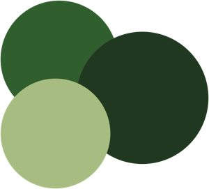

<div align="center">


<br/>



<br/>

### 🌲 최고의 인재가 만드는 최상의 결과

**POSTECH · KAIST · 서울대 · 연세대 · UNIST 출신 엔지니어들이 만듭니다**

<br/>

[](https://www.treesoop.com)
[](mailto:official@treesoop.com)
[](https://pf.kakao.com/_CWYzn)

</div>

<br/>

## 🏢 About Us

> AI/ML R&D부터 웹·앱 개발까지, End-to-End로 책임지는 기술 스튜디오

나무숲(TreeSoop)은 포항공대, 카이스트 등 국내 최고 연구 기관 출신의 엔지니어들이 모여 만든 **AI 전문 개발 & R&D 회사**입니다. 전문성과 창의력을 바탕으로 고객 만족을 실현하며, 최첨단 기술로 혁신을 선도합니다.

<br/>

## 📊 By the Numbers

<div align="center">

|  |  |  |  |
|:---:|:---:|:---:|:---:|
| **30+** | **4.92** ⭐ | **98%** | **10명** |
| 프로젝트 수행 | 위시켓 평점 | 고객 만족도 | 팀 구성원 |
| **6편** | **7억원+** | **5건+** | |
| SCI 논문 | 투자 유치 | 정부 과제 수행 | |

</div>

<br/>

## 🔬 What We Do

<table>
<tr>
<td width="33%" valign="top">

### 👁️ Computer Vision
SLAM/SfM 알고리즘, 객체 탐지,
영상 분석, 이미지 세그멘테이션

</td>
<td width="33%" valign="top">

### 🧠 NLP & LLM
LLM 파인튜닝, RAG 시스템,
AI 챗봇, 텍스트 분석

</td>
<td width="33%" valign="top">

### 🎙️ Audio & Speech
고정밀 STT, 음성 분류,
감정 분석, TTS 기술

</td>
</tr>
<tr>
<td width="33%" valign="top">

### 🚀 AI 서비스 제작
기획부터 배포까지
풀 프로덕트 개발

</td>
<td width="33%" valign="top">

### ⚡ AX & 자동화
업무 프로세스 자동화,
AI 기반 워크플로우

</td>
<td width="33%" valign="top">

### 📊 데이터 & 리서치
데이터 수집·분석·시각화,
AI 연구 컨설팅

</td>
</tr>
</table>

<br/>

## 🛠️ Tech Stack

<div align="center">

**Frontend** &nbsp;&nbsp;


**Backend** &nbsp;&nbsp;


**AI / ML** &nbsp;&nbsp;


**Infra & DB** &nbsp;&nbsp;


</div>

<br/>

## 💼 Portfolio Highlights

<table>
<tr>
<td width="50%" valign="top">

**🔬 AI/ML R&D**
- **Gaussian Splatting** — 3D 복원 기술 연구
- **Emotion AI** — 감정 인식 AI 시스템

</td>
<td width="50%" valign="top">

**🤖 RAG & Agent**
- **로봇변호사** — 법률 AI 어시스턴트
- **AI 스타트업 비서** — 업무 자동화 에이전트

</td>
</tr>
<tr>
<td width="50%" valign="top">

**🌐 AI 기반 서비스**
- **HSADASH** — AI 기반 대시보드
- **ShowOnAI** — AI 콘텐츠 플랫폼

</td>
<td width="50%" valign="top">

**📱 웹/앱 개발**
- **K-VIEWO** — 콘텐츠 서비스 플랫폼
- **퍼플엘리펀트** — 모바일 앱 서비스

</td>
</tr>
</table>

<br/>

## 🏆 Milestones

```
2024  ━━  🌲 나무숲(TreeSoop) AI 전문 회사 설립
2023  ━━  🌎 CES 2023 참가
2022  ━━  🌎 CES 2022 참가 · 💰 정부 과제 7억원 수행 · 🎵 동시접속 3만명 콘서트
2021  ━━  💰 Pre-seed $450K 투자 유치
2020  ━━  🚀 Asimula 창업 · 🏫 창업 패키지 선정
```

<br/>

## ✨ Why TreeSoop?

| | |
|:---|:---|
| 📄 **논문에서 프로덕트까지** | SCI 논문 기반 기술을 실제 서비스로 구현 |
| 🎓 **TOP 1% 연구 인력** | POSTECH, KAIST 등 최고 연구기관 출신 |
| ✅ **검증된 기술 전환 능력** | 30+ 프로젝트, 위시켓 4.92 평점 |
| 🔍 **투명한 R&D 프로세스** | Notion 기반 실시간 진행 상황 공유 |
| 🤝 **끝까지 책임지는 팀** | 유지보수·피드백까지 Agile 기반 대응 |

<br/>

## 👥 Core Team

| | |
|:---:|:---:|
| **남대현** | **김재민** |
| CEO · AI Native Engineer | AI Engineer · CV & NLP |
| POSTECH | POSTECH |

<br/>

## 📬 Contact

<div align="center">

프로젝트 문의나 협업 제안을 환영합니다!

[](https://www.treesoop.com)
&nbsp;
[](mailto:official@treesoop.com)
&nbsp;
[](https://pf.kakao.com/_CWYzn)

<br/>

📍 경기도 성남시 분당구 판교역로 109 A동 143호

</div>

<br/>

<div align="center">


</div>
